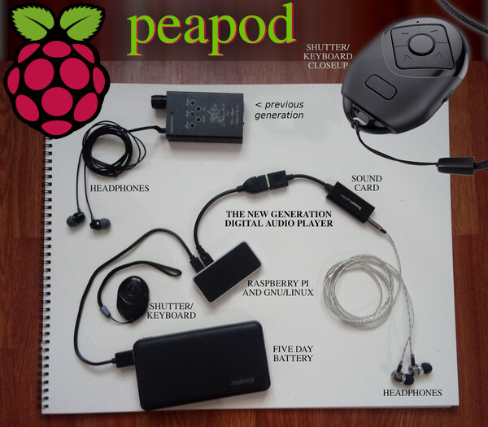

# peapod
Installation/deployment repository for the Cat Pea music player.



## TODO

- Detect USB Audio and configure ALSA card.

## TLDR;

Remember to reboot your system after running configuration, Linux requires a reboot after some of the operations in ./setup/ (apt update, etc.)

It works on RaspberryPI Zero, but start with a clean install. It will insall older node, add users and setup a systemd service.

It is configured for my beauty-r1 found under: https://www.amazon.com/gp/product/B08SWC2DQW you will have to configure the Bluetooth/driver to work with your device.


## Installation

To install peapod, you should run the install script.

To do that, login to your device ssh pi@venus and issue the following cURL or Wget command:

```sh

curl -o- https://raw.githubusercontent.com/catpea/peapod/main/install.sh | sudo bash

```

```sh

wget -qO- https://raw.githubusercontent.com/catpea/peapod/main/install.sh | sudo bash

```

### Warning

This script adds a new user to your system and alters system configuration. Run at your own risk.
peapod comes with ABSOLUTELY NO WARRANTY, to the extent permitted by applicable bleargh.

The Software shall be used for Good, not Evil.
